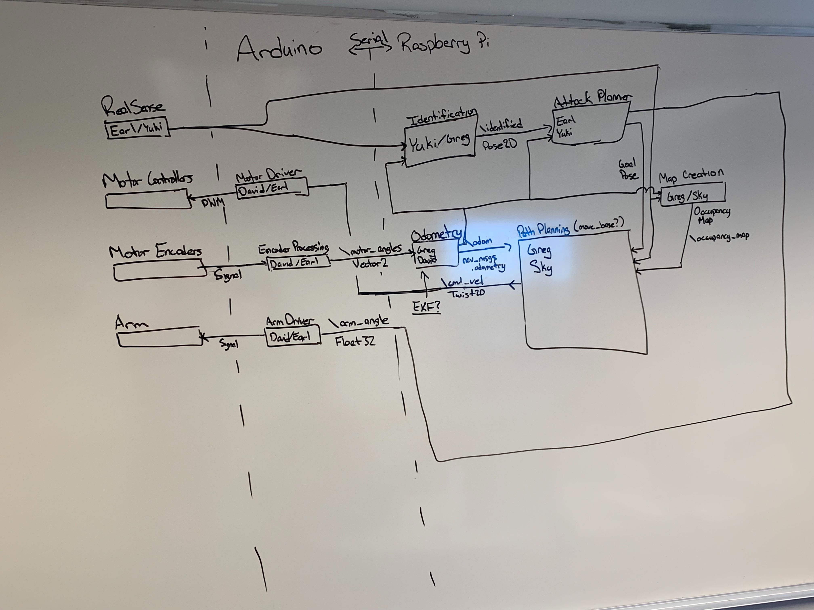

# Chomp 2.0

Chomp 2.0 is an autonomous Combat Robot inspired by Chomp, a robot appearing on the 2016 and 2018 seasons of Battlebots.

Traditionally, combat robots are operated with an RC controller by a driver outside of the arena. Smaller Sumo robots with the goal of pushing the opponent outside of the arena have started to implement autonomous systems, but most large scale robots still haven’t implemented this technology. The only exception is Chomp, a Heavyweight (250lb) Battlebot on the 2016 and 2018 season of Battlebots. Chomp is an overhead Hammer-Bot, which means that it has a main drive platform with an actuated hammer on top that inflicts damage on the opponents. While the drive system was controlled via a remote control, the weapon system was controlled by an onboard AI system. Chomp has a camera on the front of the bot that allows it to detect the position of other opponents in the arena. Using this information, the AI is able to control the hammer and strike the opponent at an optimal time. This system has worked well for Chomp; they were able to defeat Bite Force, the 2018 and 2019 world champions, and have only lost that one match. This project seeks to replicate and improve upon the software used by Chomp, and add autonomous driving control so the robot is completely autonomous. We will be fabricating a simple wheeled platform, with a 2 DOF impactor, to test our autonomy. 

### Motivation

This project is currently being developed as the final project for CSCI 3308: Intro to Robotics at the University of Colorado Boulder. As such, the platform/chassis of the robot will not be combat ready and is designed purely for ease of testing.

## System Overview

The entire system runs on ROS Melodic on a Raspberry Pi 4 with 2GB of RAM running Ubuntu 18.04. An Arduino Uno is connected to the Raspberry Pi and runs the motors. The Arduino acts as a ROS node and communicates with the Pi via rosserial.



## Running The Systen

The goal is to eventually create a .roslaunch file that is wrapped in a service that starts when the Pi boots, but for now and for testing purposes, you'll have to do the following.

### Flashing the Arduino

The Arduino runs rosserial. rosserial is a ROS package that generates CPP files that can be included in an Arduino project. Just like any other ROS program, the Arduino creates a node and can setup publishers, subscribers, services, etc. For more information on rosserial, checkout their documentation.

#### Adding rosserial to the Arduino project.

If for some reason ```roslib``` isn't a part of the Arduino project already or it needs to be regenerated, you can add it by running the following command from the root directory of the repository. 

```bash
rm -rf Arduino/lib/ros_lib
rosrun rosserial_arduino make_libraries.py Arduino/lib
```

#### Connecting the Arduino to the Raspberry Pi

So far testing has only been done with the Arduino conencted via its USB cable, but it should be able to connect via a set of wires/traces. I think there may be some flags that have to be set either in the Arduino code, or in generating ```roslib```, to use something other than the default serial port, but I know it is possible. 

The other problem is connecting the wires to the Pi. As you'll read in the next section, the Pi needs a serial port in ```/dev/tty*``` to connect to the Arduino, and I'm not sure if we can just use GPIO pins instead.

Once the Arduino is connected to the Pi, you start another ROS program on the Pi to connect the Arduino's node to the rest of the ROS system. You'll need to know the serial port of the Arduino, it should be something like ```/dev/ttyUSB0```, ```/dev/ttyACM0```, ```/dev/ttyAMA0```, etc.

```bash
rosrun rosserial_python serial_node.py /dev/ttyACM0
```

### Configuring the Raspberry Pi

All of our development is done on a Raspberry Pi 4 with 2GB of RAM running Ubuntu 18.04. These decisions were made to quicken development, not for applicability in combat robotics. Future testing will be done to see if a Raspberry Pi Zero W is feasible since it is smaller and lighter, and other operating systems will be considered. Ubuntu is only being used now becuase we're using an Intel Realsense camera, which doesn't support Raspbian.

#### Install Ubunut 18.04 on the Raspberry Pi

At time of writing, Cannonical recently relased official support for running Ubuntu Server 19.10 on the Raspberry Pi, but we could not figure out how to set it up properly. Therefore, we settled with Ubuntu 18.04 because it was easier to set up and had better community support. Follow the tutorial from James A. Chambers to install Ubuntu 18.04, it's straightforward and easy to do; he has a pre-configured image that we're using with great success.
https://jamesachambers.com/raspberry-pi-4-ubuntu-server-desktop-18-04-3-image-unofficial/

#### Install ROS on the Raspberry Pi

Since the Raspberry Pi is running Ubuntu and not Raspbian, follow tutorials for installing ROS on Ubuntu. DO NOT follow tutorials for installing on the Raspberry Pi, these assume you are using Raspbian and most likely will not work. At time of writing, ROS Melodic is the latest release and is what we're using. You can find instructions on setting this up [here](http://wiki.ros.org/melodic/Installation/Ubuntu).

Please note that you will probably want to install ROS Melodic (or other version) on your development machine as well. Instructions for doing that can be found [here](http://wiki.ros.org/melodic/Installation).

#### Starting ROS on the Raspberry Pi

Starting ROS on the Raspberry Pi is the same as any other OS, simply run

```
roscore
```

#### Testing Arduino Communication (OPTIONAL)

Assuming you're following the order of this README, you already have ROS installed on the Raspberry Pi, the Arduino program flashed on the Arduino, and the Arduino connected to the Pi. If this is not the case, stop and do those things, then come back here.

We've included a simple subscriber in the Arduino code at ```/toggle_led``` that takes an ```std_msgs/Empty``` and toggles the built-in LED when some other node publishes on ```/toggle_led```. First, make sure the Arduino program is connected to the ROS system:

```bash
rosrun rosserial_python serial_node.py /dev/ttyACM0
```

Now, publish to the ```/toggle_led``` topic from the command line on the Raspberry Pi.

```bash
rostopic pub /toggle_led std_msgs/Empty
```

If everything is connected properly, you should see the LED built-in to the Arduino toggle on/off when you run the previous command.

#### Running Our ROS Program

Once we start writing ROS nodes/programs, we'll include details about how to use them here

## ROS Topics

Below is some very basic documentation/info on what topics are available and what they do

### `/toggle_led`

| Name | Message Type | Units | Publishing Node |
|---|---|---|---|
| `/toggle_led` | `Empty` | None | User |

Toggles the Arduino's onboard LED attached to GPIO Pin 13.

### `/cmd_vel`

| Name | Message Type | Units | Publishing Node |
|---|---|---|---|
| `/cmd_vel` | `Twist` | m/s | ??? (User) |

Known Subscribers:
 - `cmd_vel_compensator`

Takes a `Twist` that describes the velocity of the 6 degrees of freedom of the robot's frame of reference. This is what drives the motors at the highest level, although in practice the message is sent through a compensator and inverse kinematics layers.

### `/cmd_vel_comp`
| Name | Message Type | Units | Publishing Node |
|---|---|---|---|
| `/cmd_vel_comp` | `Twist` | m/s | cmd_vel_compensator |

Known Subscribers
 - Arduino Serial

Uses a simple Proportional-Integral (PI) Feedback Controller to minimze error introduced by the motors. Reference signal is the `cmd_vel` `Twist` that the node subscribes to, and the feedback is based off of the measured `motor_angles` topic. The difference between these values is the error signal, which is multiplied by a Proportional Gain, and added to an integrated error, which is then sent to the motors, AKA the plant.

### `/motor_angles`

| Name | Message Type | Units | Publishing Node |
|---|---|---|---|
| `/motor_angles` | `Vector3` | radians | rosserial |

Known Subscribers:
 - Odometry
 - cmd_vel_compensator

Takes the signal from the encoders attached to each motor and calculates how far each motor has rotated since being turned on.

### `/odometry`

| Name | Message Type | Units | Publishing Node |
|---|---|---|---|
| `/odometry` | `Pose2D` | m - radians | odometry |

Known Subscribers:
 - None

Publishes the robot's location in the world frame whenever new data is available from `/motor_angles`

### `/arm_angle`

| Name | Message Type | Units | Publishing Node |
|---|---|---|---|
| `/arm_angle` | `Float` | degrees | rosserial |

Known Subscribers:
 - None

Sets the position of the weapon arm. Offset from the initial location of the arm.
